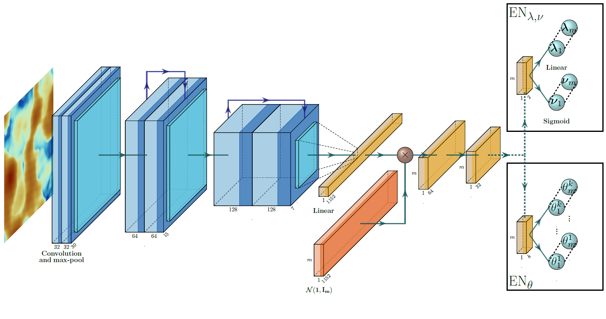
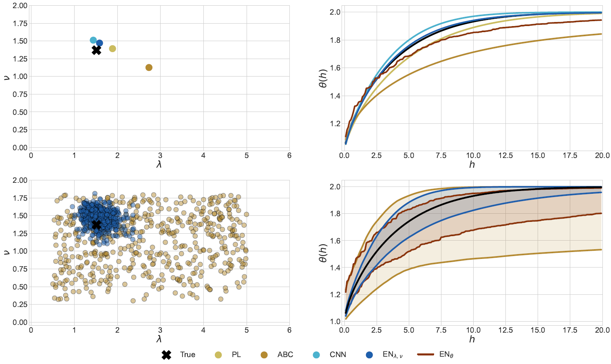
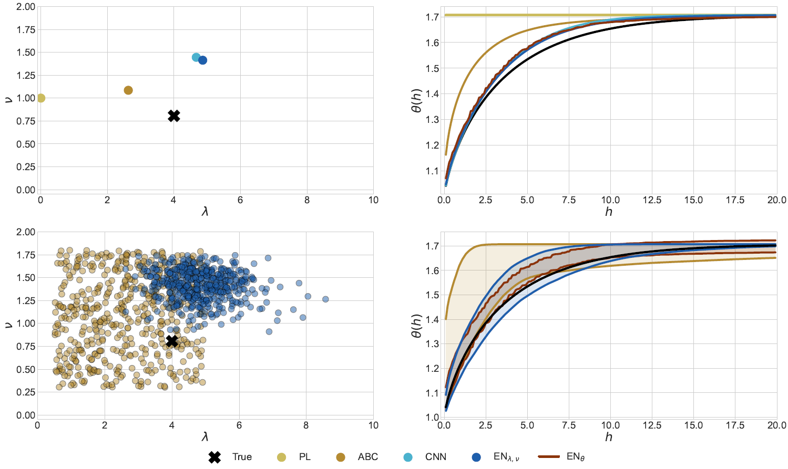
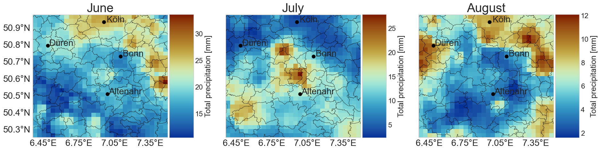
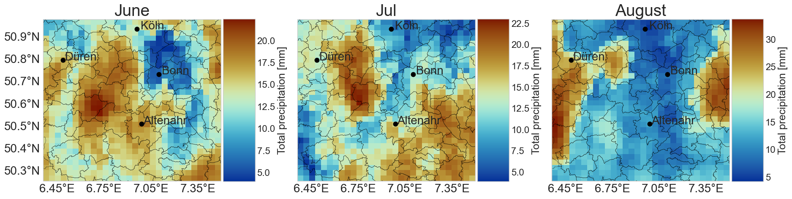
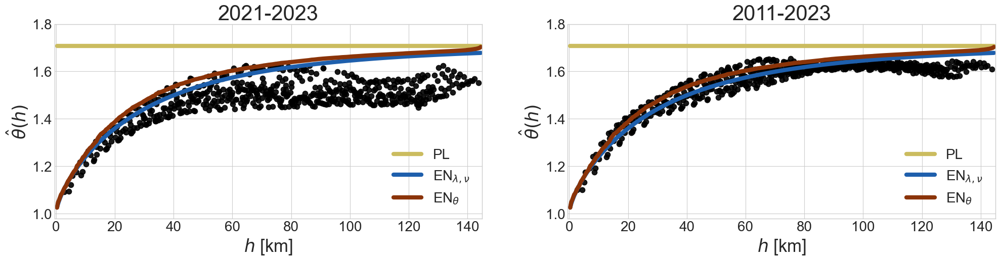

# Estimation of Extremes for Spatio-Temporal Processes with Neural Networks

This repository contains the code accompanying the paper
> Bülte, C., Leimenstoll, L. and Schienle, M. (2024). Estimation of spatio-temporal extremes via generative neural networks (preprint available at https://arxiv.org/tbd)
     
    
The code includes methods for reproducing the results, as well as general implementation of our parameter and functional estimation approaches. For an overview of the code and the methodology, see below.

# Abstract
Recent methods in modeling spatial extreme events have focused on utilizing parametric max-stable processes and their underlying dependence structure. In this work, we provide a unified approach for analyzing spatial extremes with little available data by estimating the distribution of model parameters or the spatial dependence directly. By employing recent developments in generative neural networks we predict a full sample-based distribution, allowing for direct assessment of uncertainty regarding model parameters or other parameter dependent functionals. We validate our method by fitting several simulated max-stable processes, showing a high accuracy of the approach, regarding parameter estimation, as well as uncertainty quantification. Additional robustness checks highlight the generalization and extrapolation capabilities of the model, while an application to precipitation extremes across Western Germany demonstrates the usability of our approach in real-world scenarios.
 
# Repository structure

| Folder | Description |
| ---- | ----------- | 
| `abc` | Contains code related to the Approximate Bayesian Computing (ABC) method. |
| `application` | Contains code regarding the empirical part of the thesis. |
| `data` | Contains the data used in the thesis and required to reproduce the results. |
| `evaluation` | Contains code for evaluating the different models. |
| `mle` | Contains code related to the Pairwise Likelihood approach. |
| `networks` | Contains the implementation of the neural networks. |
| `plots` | Contains code for the plots used in the thesis. |
| `scripts` | Contains scripts for reproducing results. |
| `simulation` | Contains code for simulating max-stable processes. |
| `utils` | Contains utility functions. |

# Setup

1. Install `Python` (see [here](https://python.org/)) and `R` (see [here](https://www.r-project.org/)).
	- `Python` is easiest installed by using the anaconda package manager (see [here](https://www.anaconda.com/)).
1. Clone project   
    - ```git clone https://github.com/cbuelt/spatio-temporal-extremes```
1. Install the `R` packages.
	- Source the file `utils/requirements.R`.
1. Install the python requirements.
    - Create a conda environment using ```conda env create -f utils/requirements.yml```
    - For help see see [here](https://docs.conda.io/projects/conda/en/latest/user-guide/tasks/manage-environments.html)

# Data

For the simulation studies, the generated max-stable processes (in the form of training/test data) can be found in the corresponding folder. The results for the benchmarks are also available, as well as the tables with the result metrics. As the neural network estimatos produce fairly large output files, only the trained checkpoints are uploaded. For generating the corresponding (deterministic) results, see below.

For the analysis of precipitation extremes across Germany, the data needs to be downloaded from DWD at https://opendata.dwd.de/climate_environment/CDC/grids_germany/daily/hyras_de/precipitation/

# Reproducing results

The results for all experiments can be found in the corresponding folders. Invoking the script `reproduce_results.sh` will perform inference for the neural network approaches based on the training checkpoints. The metrics can be recalculated by running `evaluation/calculate_results.py`. Visualizations of figures and tables is done in interactive and easy-to-use Jupyter notebooks. The same goes for the precipitation application, which requires the data download for the years 1931-2023.

For running completely new simulations, you can follow these steps:
- Create a new experiment folder.
- Run simulations from the `simulations` folder, specified to your needs.
- Adjust the `networks/config.py` file to your scenario.
- Run `networks/train_model.py` in order to create predictions.
- For evaluation adjust and run `evaluation/calculate_results.py` for calculating the same metrics as in our study.

# Methodology
Our main contributions are:
- Development of an estimation approach based on generative neural networks that allows for uncertainty quantification of parameters or model functionals
- Application to max-stable processes in order to analyze spatial extremes
- Extensive evaluation of the approach with regards to several novel metrics
- Application to extreme precipitation events across Western Germany

In the following are some of the important visualizations, for further details see the referenced publication.


## Proposed neural network architecture
The figure shows the proposed model architecture. The spatial field is fed through three blocks convolutional and max-pooling layers. Across the blocks, the output size decreases, while the channel size increases. In the second and third block, residual connections are added, marked by the arrows on top. After the convolutional layers the network is flattened and fed through some final linear layers, where Gaussian noise is multiplied on top to finally create $m$ output samples. For parameter prediction, samples of $\lambda, \nu$ are created, while for the direct estimation of the extremal coefficient function, sample points of the function are predicted as $\theta^i_j := \hat{\theta}_j(h_i)$.



## Exemplary simulation results
The figure visualizes the different estimation methods for the max-stable models using a selected test sample $(\lambda, \nu) = (1.51, 1.37)$ for the Brown-Resnick model. In each figure the upper left panel shows the different location estimates, while the upper right panel shows the estimated extremal coefficient functions. The lower left panel shows the sample-based distribution estimates of the $\mathrm{ABC}$ and $\mathrm{EN}_{\lambda,\nu}$ method and the lower right panel shows the estimated pointwise confidence intervals ($\alpha = 0.05$) for the extremal coefficient function.



The figure visualizes the different estimation methods for the Whittle-Matérn kernel (robustness scenario #2) using a selected test sample $(\lambda, \nu) = (4.00, 0.81)$. The plot division is the same as above.



## Analysis of precipitation extremes

Some results on the analysis of summer precipitation maxima across Western Germany.

### Visualization of precipiation fields
The figure shows the observed precipitation maxima in 2022 (top) and corresponding simulations from an estimated Schlather model with powered exponential correlation function (bottom ). The simulations have been transformed back to the original GEV surface.





### Estimation of spatial dependence

The figure shows the different estimates for the extremal coefficient function. The black dots are the binned F-madogram estimates and the lines correspond to the pointwise mean of the estimated extremal coefficient functions. The left panels shows F-madogram estimate with data from 2021-2023 and the right panel with data from 2011-2023.



# License
This work is published under the MIT license.


